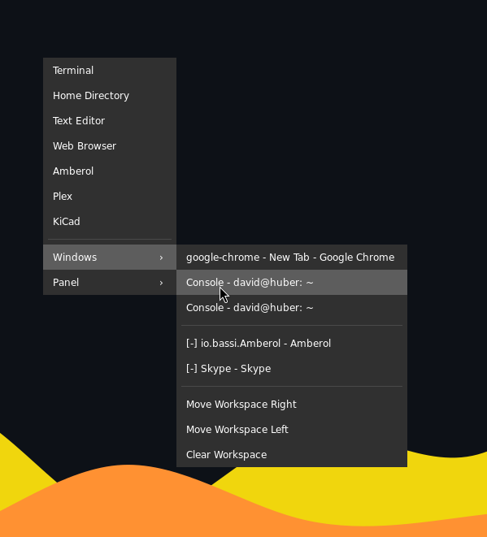
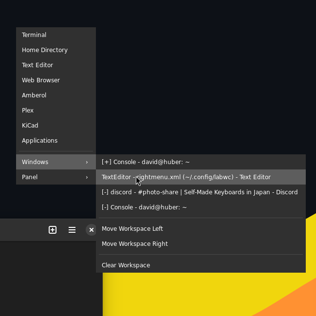

# labwcpipemenus

## What is all this?

So hear me out, I don't want to use a panel or dock or anything, I just want to go back, way back to the old days, but I do *need* access to a list of windows I have open somehow....

### Sounds reasonable, but why so many that do the same thing?

I'm just trying to figure it out, some tools are more experimental (like lswt) and less easily available.

### What's the catch?

If there are multiple windows with the same name and id (possibly terminals, maybe file managers) there can be an element of chance as to if it raises the right one, this is reasonably well minimised by querying the state as well as the id and title, lswt has an unique identifier option which might prove useful in the future... This is ever so slightly less likely to happen using app-list-q.sh.

### Whatever, which 'app-list' do I use and why?

#### Probably this one:

[app-list.sh](app-list.sh) - this only uses wlrctrl, which is widely available in most distributions, it also splits the window lists into minimised and viewable rather than in one list mixed up, but only shows if a window is minimised or not. It supports manually excluding apps from the list too. It has the least obscure app 'dependencies' so should work on most systems without having to build anything.   

#### The other 'app-lists'
app-list-cut.sh - this uses lswt and wlrctrl and uses cut (doesn't require jq and will only work with lswt 2.*) - supports minimised and active window identification as well as the ability to manually exclude certain windows from the list, faster than the jq version. 

app-list-q.sh - this uses lswt and wlrctrl and jq for parsing the output from lswt (will work better with all versions of lswt)  - supports minimised and active window identification, gets slow quick. 

All the lswt menus look like this, [-] signifies minimised and [+] means active/has focus.

app-list-term.sh -  mostly the same as app-list.sh but splits out terminals into their own menu to avoid clutter, if you use a lot of terminals.

There are some other quirks here and there like hiding and showing seperators depending on requirements, but they do involve extra queries which might slow it down.

## So what else is there?

...

